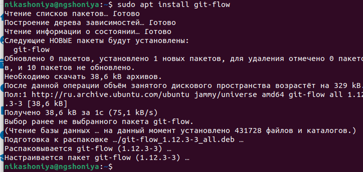
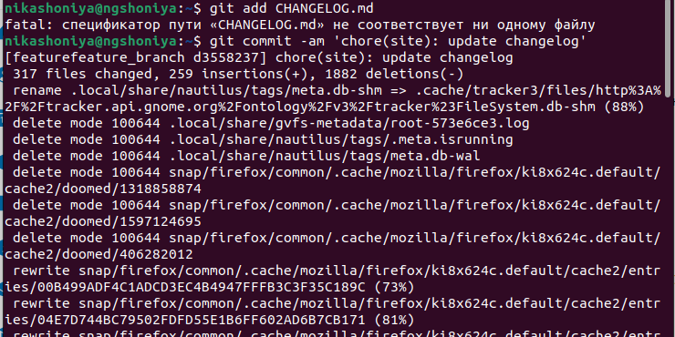

---
## Front matter
title: "Лабораторная работа №4"
subtitle: "Дисциплина: Операционные системы"
author: "Шония Ника Гигловна"

## Generic otions
lang: ru-RU
toc-title: "Содержание"

## Bibliography
bibliography: bib/cite.bib
csl: pandoc/csl/gost-r-7-0-5-2008-numeric.csl

## Pdf output format
toc: true # Table of contents
toc-depth: 2
lof: true # List of figures
lot: true # List of tables
fontsize: 12pt
linestretch: 1.5
papersize: a4
documentclass: scrreprt
## I18n polyglossia
polyglossia-lang:
  name: russian
  options:
	- spelling=modern
	- babelshorthands=true
polyglossia-otherlangs:
  name: english
## I18n babel
babel-lang: russian
babel-otherlangs: english
## Fonts
mainfont: PT Serif
romanfont: PT Serif
sansfont: PT Sans
monofont: PT Mono
mainfontoptions: Ligatures=TeX
romanfontoptions: Ligatures=TeX
sansfontoptions: Ligatures=TeX,Scale=MatchLowercase
monofontoptions: Scale=MatchLowercase,Scale=0.9
## Biblatex
biblatex: true
biblio-style: "gost-numeric"
biblatexoptions:
  - parentracker=true
  - backend=biber
  - hyperref=auto
  - language=auto
  - autolang=other*
  - citestyle=gost-numeric
## Pandoc-crossref LaTeX customization
figureTitle: "Рис."
tableTitle: "Таблица"
listingTitle: "Листинг"
lofTitle: "Список иллюстраций"
lotTitle: "Список таблиц"
lolTitle: "Листинги"
## Misc options
indent: true
header-includes:
  - \usepackage{indentfirst}
  - \usepackage{float} # keep figures where there are in the text
  - \floatplacement{figure}{H} # keep figures where there are in the text
---

# Цель работы

Получение навыков правильной работы с репозиториями git.

# Задание

1. Установка git-flow
2. Установка Node.js
3. Настройка Node.js
4. Общепринятые коммиты

# Теоретическое введение

Рабочий процесс Gitflow

    Рабочий процесс Gitflow Workflow. Будем описывать его с использованием пакета git-flow.

Общая информация

    Gitflow Workflow опубликована и популяризована Винсентом Дриссеном.
    Gitflow Workflow предполагает выстраивание строгой модели ветвления с учётом выпуска проекта.
    Данная модель отлично подходит для организации рабочего процесса на основе релизов.
    Работа по модели Gitflow включает создание отдельной ветки для исправлений ошибок в рабочей среде.
    Последовательность действий при работе по модели Gitflow:
        Из ветки master создаётся ветка develop.
        Из ветки develop создаётся ветка release.
        Из ветки develop создаются ветки feature.
        Когда работа над веткой feature завершена, она сливается с веткой develop.
        Когда работа над веткой релиза release завершена, она сливается в ветки develop и master.
        Если в master обнаружена проблема, из master создаётся ветка hotfix.
        Когда работа над веткой исправления hotfix завершена, она сливается в ветки develop и master.

# Выполнение лабораторной работы

1. Установка git-flow
Устанавливаем git-flow {#fig:001 width=70%}
2. Установка Node.js
Установливаем Node.js {#fig:001 width=70%}
3. Настройка Node.js
Запускаю pnpm setup {#fig:001 width=70%}
выполняю source ~/.bashrc {#fig:001 width=70%}
4. Общепринятые коммиты
Данная программа используется для помощи в форматировании коммитов. {#fig:001 width=70%}
Создаю репозиторий {#fig:001 width=70%}
Делаем первый коммит и выкладываем на github {#fig:001 width=70%}(image/07.png){#fig:001 width=70%}
Конфигурация для пакетов Node.js {#fig:001 width=70%}
Необходимо заполнить несколько параметров пакета. {#fig:001 width=70%}
Добавим новые файлы {#fig:001 width=70%}
Выполним коммит {#fig:001 width=70%}
Отправим на github {#fig:001 width=70%}
Инициализируем git-flow {#fig:001 width=70%}
Проверьте, что Вы на ветке develop {#fig:001 width=70%}
Загрузите весь репозиторий в хранилище {#fig:001 width=70%}
Установите внешнюю ветку как вышестоящую для этой ветки: {#fig:001 width=70%}
Создадим релиз с версией 1.0.0 {#fig:001 width=70%}
Создадим журнал изменений {#fig:001 width=70%}
Добавим журнал изменений в индекс {#fig:001 width=70%}
Отправим данные на github {#fig:001 width=70%}
(image/20.png){#fig:001 width=70%}
Создадим релиз на github. Для этого будем использовать утилиты работы с github {#fig:001 width=70%}
Создадим ветку для новой функциональности {#fig:001 width=70%}
По окончании разработки новой функциональности следующим шагом следует объединить ветку feature_branch c develop {#fig:001 width=70%}
Создадим релиз с версией 1.2.3 {#fig:001 width=70%}
Создадим журнал изменений {#fig:001 width=70%}
Добавим журнал изменений в индекс {#fig:001 width=70%}
Зальём релизную ветку в основную ветку {#fig:001 width=70%}
Отправим данные на github {#fig:001 width=70%}(image/30.png){#fig:001 width=70%}
Создадим релиз на github с комментарием из журнала изменений {#fig:001 width=70%}

# Выводы

Я получила навыки правильной работы с репозиториями git.

# Список литературы{.unnumbered}

::: {#refs}
:::
