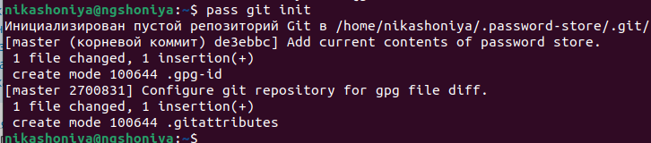

---
## Front matter
title: "Лабораторная работа №5"
subtitle: "Операционные системы"
author: "Шония Ника Гигловна"

## Generic otions
lang: ru-RU
toc-title: "Содержание"

## Bibliography
bibliography: bib/cite.bib
csl: pandoc/csl/gost-r-7-0-5-2008-numeric.csl

## Pdf output format
toc: true # Table of contents
toc-depth: 2
lof: true # List of figures
lot: true # List of tables
fontsize: 12pt
linestretch: 1.5
papersize: a4
documentclass: scrreprt
## I18n polyglossia
polyglossia-lang:
  name: russian
  options:
	- spelling=modern
	- babelshorthands=true
polyglossia-otherlangs:
  name: english
## I18n babel
babel-lang: russian
babel-otherlangs: english
## Fonts
mainfont: PT Serif
romanfont: PT Serif
sansfont: PT Sans
monofont: PT Mono
mainfontoptions: Ligatures=TeX
romanfontoptions: Ligatures=TeX
sansfontoptions: Ligatures=TeX,Scale=MatchLowercase
monofontoptions: Scale=MatchLowercase,Scale=0.9
## Biblatex
biblatex: true
biblio-style: "gost-numeric"
biblatexoptions:
  - parentracker=true
  - backend=biber
  - hyperref=auto
  - language=auto
  - autolang=other*
  - citestyle=gost-numeric
## Pandoc-crossref LaTeX customization
figureTitle: "Рис."
tableTitle: "Таблица"
listingTitle: "Листинг"
lofTitle: "Список иллюстраций"
lotTitle: "Список таблиц"
lolTitle: "Листинги"
## Misc options
indent: true
header-includes:
  - \usepackage{indentfirst}
  - \usepackage{float} # keep figures where there are in the text
  - \floatplacement{figure}{H} # keep figures where there are in the text
---

# Цель работы

Научиться работать с шаблонами и шрифтами

# Задание

1. Менеджер паролей pass
2. Управление файлами конфигурации

# Теоретическое введение

    Шаблоны используются для изменения содержимого файла в зависимости от среды.
    Используется синтаксис шаблонов Go.
    Файл интерпретируется как шаблон, если выполняется одно из следующих условий:
        имя файла имеет суффикс .tmpl;
        файл находится в каталоге .chezmoitemplates.

Данные шаблона

    Полный список переменных шаблона:

    chezmoi data

    Источники переменных:
        файлы .chezmoi, например, .chezmoi.os;
        файлы конфигурации .chezmoidata.$FORMAT. Форматы (json, jsonc, toml, yaml) читаются в алфавитном порядке;
        раздел data конфигурационного файла.

# Выполнение лабораторной работы

1. Менеджер паролей pass
Установка pass {#fig:001 width=70%}
Установка gopass {#fig:001 width=70%}
Инициализация хранилища {#fig:001 width=70%}
Создала репозиторий {#fig:001 width=70%}
Создадим структуру git {#fig:001 width=70%}
задать адрес репозитория на хостинге {#fig:001 width=70%}
Для синхронизации выполняется следующая команда {#fig:001 width=70%}
{#fig:001 width=70%}
необходимо вручную закоммитить и выложить изменения {#fig:001 width=70%}
Проверить статус синхронизации модно командой {#fig:001 width=70%}
кроме плагина к броузеру устанавливается программа, обеспечивающая интерфейс native messaging {#fig:001 width=70%}
{#fig:001 width=70%}
Добавить новый пароль {#fig:001 width=70%}
2. Управление файлами конфигурации
Установить дополнительное программное обеспечение {#fig:001 width=70%}(image/15.png){#fig:001 width=70%}
Установка бинарного файла {#fig:001 width=70%}
Создадим свой репозиторий для конфигурационных файлов на основе шаблона {#fig:001 width=70%}
Инициализируйте chezmoi с вашим репозиторием dotfiles {#fig:001 width=70%}
Проверьте, какие изменения внесёт chezmoi в домашний каталог, запустив chezmoi diff {#fig:001 width=70%}
На второй машине инициализируйте chezmoi с вашим репозиторием dotfiles {#fig:001 width=70%}
Разные действия с командой chezmoi {#fig:001 width=70%}
При существующем каталоге chezmoi можно получить и применить последние изменения из вашего репозитория {#fig:001 width=70%}
Выполнение команд {#fig:001 width=70%}

# Выводы

Скачали шрифты, сделали работу с шаблонами

# Список литературы{.unnumbered}

::: {#refs}
:::
